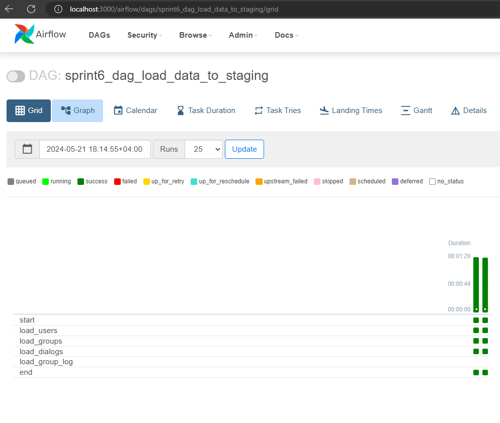
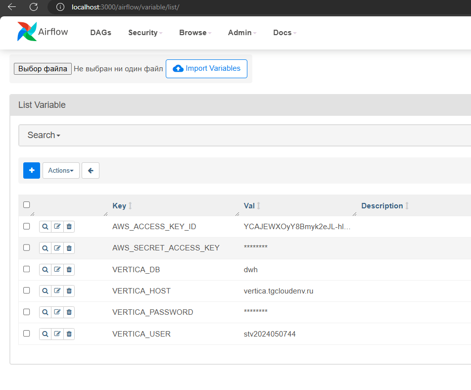

Витрина на данных аналитической БД Vertica
Задачи	Результаты
Расширить модель данных в аналитической БД
Разработать витрину данных для оценки эффективности рекламы

Реализация
Шаг 1. Загрузить данные из S3
Для загрузки данных из S3 создал DAG в Airflow.

В нем идет подключение к бакету sprint6 в S3 и выгрузка файла group_log.csv в папку data.

Код в task load_s3_files_task_id

    @task(task_id="load_s3_files_task_id") 
    def load_s3_files_task():
        logging.info ('Start load from S3')

        AWS_ACCESS_KEY_ID = Variable.get("AWS_ACCESS_KEY_ID")
        AWS_SECRET_ACCESS_KEY = Variable.get("AWS_SECRET_ACCESS_KEY")

        session = boto3.session.Session()
        s3_client = session.client(
            service_name='s3',
            endpoint_url='https://storage.yandexcloud.net',
            aws_access_key_id=AWS_ACCESS_KEY_ID,
            aws_secret_access_key=AWS_SECRET_ACCESS_KEY,
        )

        for file_name in bucket_files_list:
            logging.info('Downloading ' + file_name)

            s3_client.download_file(
                Bucket='sprint6',
                Key=file_name,
                Filename='/data/' + file_name
        )
Шаг 2. Создать таблицу group_log в Vertica
Создал таблицу group_log в схеме _STAGING с учётом формата данных в скачанном файле. Создал внешние ключи на существующие в _STAGING таблицы.

drop table if exists STV2024050744__STAGING.group_log;

create table STV2024050744__STAGING.group_log
(
    group_id   integer ,
    user_id   integer ,
    user_id_from integer ,
    event varchar(10) ,
    event_datetime timestamp
)
order by group_id, user_id
SEGMENTED BY hash(group_id) all nodes
PARTITION BY event_datetime::date
GROUP BY calendar_hierarchy_day(event_datetime::date, 3, 2) 
;

ALTER TABLE STV2024050744__STAGING.group_log ADD CONSTRAINT fk_group_log_groups_group_id FOREIGN KEY (group_id) references STV2024050744__STAGING.groups (id);
ALTER TABLE STV2024050744__STAGING.group_log ADD CONSTRAINT fk_group_log_users_user_id_from FOREIGN KEY (user_id) references STV2024050744__STAGING.users (id);
ALTER TABLE STV2024050744__STAGING.group_log ADD CONSTRAINT fk_group_log_users_user_id FOREIGN KEY (user_id_from) references STV2024050744__STAGING.users (id);
Шаг 3. Загрузить данные в Vertica
В DAG добавил задачу, в которой считываю из папки data файл group_log.csv и загружаю его в созданную таблицу group_log в схеме __STAGING с помощью библиотеки vertica_python функцией COPY file_name FROM LOCAL.

Код в task load_to_vertica_stg_id

    @task(task_id="load_to_vertica_stg_id")
    def load_to_vertica_stg_task():
        logging.info('Start load to Vertica STG')

        conn_info = {'host': Variable.get("VERTICA_HOST"), # Адрес сервера 
             'port': '5433', # Порт из инструкции,
             'user': Variable.get("VERTICA_USER"), # Полученный логин
             'password': Variable.get("VERTICA_PASSWORD"),
             'database': Variable.get("VERTICA_DB"),
             'autocommit': True
            }

        with vertica_python.connect(**conn_info) as connection:
            cur = connection.cursor()

            cur.execute("truncate table STV2024050744__STAGING.group_log")

                exec = cur.execute("""COPY STV2024050744__STAGING.group_log("group_id", "user_id", "user_id_from", "event", "event_datetime") 
                     FROM LOCAL '/data/group_log.csv' 
                     DELIMITER ','
                     skip 1
                     REJECTED DATA AS TABLE STV2024050744__STAGING.group_log_rej""",
                    buffer_size=65536
            )
            r = cur.fetchall()
            logging.info("Rows loaded to group_log:" + str(r))
Шаг 4. Создать таблицу связи
Создал в схеме __DWH таблицу связи l_user_group_activity Создал внешние ключи на существующие в _DWH таблицы.

drop table if exists STV2024050744__DWH.l_user_group_activity ;

create table STV2024050744__DWH.l_user_group_activity
(
   hk_l_user_group_activity integer PRIMARY KEY,
   hk_user_id int not null,
   hk_group_id int not null,
   load_dt timestamp not null,
   load_src VARCHAR(20)
);

ALTER TABLE STV2024050744__DWH.l_user_group_activity ADD CONSTRAINT fk_uga_users_hk_user_id FOREIGN KEY (hk_user_id) references STV2024050744__DWH.h_users(hk_user_id);
ALTER TABLE STV2024050744__DWH.l_user_group_activity ADD CONSTRAINT fk_uga_groups_hk_group_id FOREIGN KEY (hk_group_id) references STV2024050744__DWH.h_groups(hk_group_id);
Шаг 5. Создать скрипты миграции в таблицу связи
Составил SQL-скрипт миграции данных из _STAGING.group_log в созданную таблицу-линк l_user_group_activity. Скрипт вызывается в DAG.

Код в task transfer_to_vertica_dds_links_task_id

    @task(task_id="transfer_to_vertica_dds_links_task_id")
    def transfer_to_vertica_dds_links_task():
        logging.info('Start transfer to Vertica DDS links')

        conn_info = {'host': Variable.get("VERTICA_HOST"), # Адрес сервера 
             'port': '5433', # Порт из инструкции,
             'user': Variable.get("VERTICA_USER"), # Полученный логин
             'password': Variable.get("VERTICA_PASSWORD"),
             'database': Variable.get("VERTICA_DB"),
             'autocommit': True
            }

        with vertica_python.connect(**conn_info) as connection:
            cur = connection.cursor()

            cur.execute(
              """ INSERT INTO STV2024050744__DWH.l_user_group_activity( 
                   hk_l_user_group_activity, hk_user_id, hk_group_id, load_dt,load_src) 
                select distinct 
                  hash(hk_user_id, hk_group_id) as hk_l_user_group_activity, 
                  hk_user_id, 
                  hk_group_id, 
                  now() as load_dt, 
                  's3' as load_src 
               from STV2024050744__STAGING.group_log as sgl 
               left join STV2024050744__DWH.h_users hu on hu.user_id = sgl.user_id 
               left join STV2024050744__DWH.h_groups hg on hg.group_id = sgl.group_id 
               where hash(hk_user_id, hk_group_id) not in (select hk_l_user_group_activity from STV2024050744__DWH.l_user_group_activity)
               ; """ 
            ) 
            r = cur.fetchall()
            print("Rows loaded from STG group_log to DWH l_user_group_activity:", r)
Шаг 6. Создать и наполнить сателлит
Создал в схеме _DWH сателлит s_auth_history

drop table if exists STV2024050744__DWH.s_auth_history ;

create table STV2024050744__DWH.s_auth_history
(
   hk_l_user_group_activity integer ,
   user_id_from int not null,
   event varchar(10) ,
   event_dt timestamp,
   load_dt timestamp not null,
   load_src VARCHAR(20)
);

ALTER TABLE STV2024050744__DWH.s_auth_history ADD CONSTRAINT fk_auth_hist_uga FOREIGN KEY (hk_l_user_group_activity) references STV2024050744__DWH.l_user_group_activity(hk_l_user_group_activity);
Заполнил его данными из _STAGING.group_log и необходимых таблиц в хранилище через скрипт миграции.

INSERT INTO STV2024050744__DWH.s_auth_history( 
  hk_l_user_group_activity, user_id_from, event, event_dt, load_dt, load_src)       
  select
   luga.hk_l_user_group_activity,
   gl.user_id_from,
   gl.event,
   gl.event_datetime,
   now() as load_dt,
   's3' as load_src
   from STV2024050744__STAGING.group_log as gl
   left join STV2024050744__DWH.h_groups as hg on gl.group_id = hg.group_id
   left join STV2024050744__DWH.h_users as hu on gl.user_id = hu.user_id
   left join STV2024050744__DWH.l_user_group_activity as luga on hg.hk_group_id = luga.hk_group_id and hu.hk_user_id = luga.hk_user_id
Шаги 7. Подготовить CTE для ответов бизнесу
Шаг 7.1. Подготовить CTE user_group_messages
Составил вспомогательный SQL-запрос, в котором вложенный запрос возвращает хэш-ключ каждой группы hk_group_id и количество пользователей в группе, которые написали хотя бы раз — cnt_users_in_group_with_messages

with user_group_messages as (
    select lgd.hk_group_id, count(distinct lum.hk_user_id) cnt_users_in_group_with_messages
     from STV2024050744__DWH.l_groups_dialogs lgd
     left join STV2024050744__DWH.l_user_message lum on lum.hk_message_id = lgd.hk_message_id
     group by lgd.hk_group_id
)

select hk_group_id,
            cnt_users_in_group_with_messages
from user_group_messages
order by cnt_users_in_group_with_messages
limit 10 ;
Шаг 7.2. Подготовить CTE user_group_log
Составил вспомогательный SQL-запрос, в котором вложенный запрос возвращает хэш-ключ каждой группы hk_group_id и количество пользователей в группе, которые в неё просто вступили cnt_added_users

with user_group_log as (
    select hg.hk_group_id, hg.registration_dt, count(DISTINCT luga.hk_user_id) cnt_added_users
    from STV2024050744__DWH.h_groups hg 
    left join STV2024050744__DWH.l_user_group_activity luga on luga.hk_group_id = hg.hk_group_id
    left join STV2024050744__DWH.s_auth_history sah on sah.hk_l_user_group_activity = luga.hk_l_user_group_activity 
    where sah.event = 'add'
    group by hg.hk_group_id, hg.registration_dt
    order by hg.registration_dt 
    limit 10
)
select hk_group_id, cnt_added_users
from user_group_log
order by cnt_added_users
limit 10 	;
Шаг 7.3. Написать запрос и ответить на вопрос бизнеса
Составил SQL-запрос, который выводит по десяти самым старым группам: хэш-ключ группы hk_group_id Количество новых пользователей группы (event = add) - поле cnt_added_users. Количество пользователей группы, которые написали хотя бы одно сообщение - поле cnt_users_in_group_with_messages. Долю пользователей группы, которые начали общаться - поле group_conversion. Результаты отсортированы по убыванию значений поля group_conversion.

WITH user_group_log AS (
    SELECT 
        hg.hk_group_id,
        COUNT(DISTINCT sa.user_id_from) AS cnt_added_users
    FROM STV2024050744__DWH.s_auth_history AS sa
    LEFT JOIN STV2024050744__DWH.h_groups AS hg ON sa.hk_l_user_group_activity = hg.hk_group_id
    WHERE sa.event = 'add'
    GROUP BY hg.hk_group_id
    ORDER BY MIN(hg.registration_dt)
    LIMIT 10
),
user_group_messages AS (
    SELECT 
        hg.hk_group_id,
        COUNT(DISTINCT sa.user_id_from) AS cnt_users_in_group_with_messages
    FROM STV2024050744__DWH.s_auth_history AS sa
    LEFT JOIN STV2024050744__DWH.h_groups AS hg ON sa.hk_l_user_group_activity = hg.hk_group_id
    WHERE sa.event = 'message'
    GROUP BY hg.hk_group_id
)

SELECT 
    ugl.hk_group_id,
    ugl.cnt_added_users,
    COALESCE(ugm.cnt_users_in_group_with_messages, 0) AS cnt_users_in_group_with_messages,
    (COALESCE(ugm.cnt_users_in_group_with_messages, 0) / NULLIF(ugl.cnt_added_users, 0)) AS group_conversion
FROM user_group_log AS ugl
LEFT JOIN user_group_messages AS ugm ON ugl.hk_group_id = ugm.hk_group_id
ORDER BY group_conversion DESC;

hk_group_id	        cnt_added_users	cnt_users_in_group_with_messages	group_conversion
206904954090724337	        4311	     1925	                        0.446532127116678265
7174329635764732197	        4794         2140	                        0.446391322486441385
4350425024258480878	        4172	     1831	                        0.438878235858101630
9183043445192227260	        3725	     1605	                        0.430872483221476510
2461736748292367987	        3575	     1539	                        0.430489510489510490
3214410852649090659	        3781	     1612	                        0.426342237503306004
5568963519328366880	        4298	     1827	                        0.425081433224755700
6014017525933240454	        3405	     1361	                        0.399706314243759178
7757992142189260835	        2505	     880	                        0.351297405189620758
7279971728630971062	        1914	     646	                        0.337513061650992685